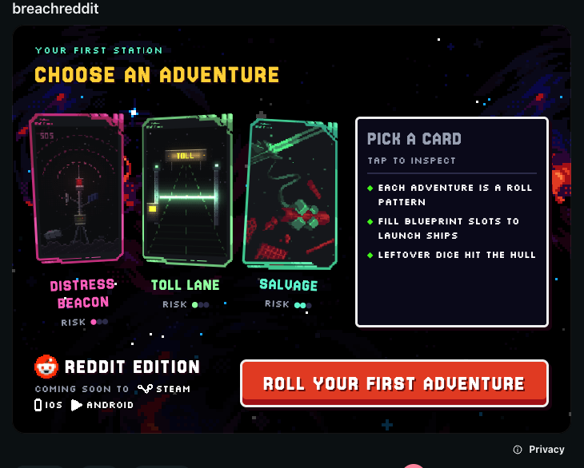
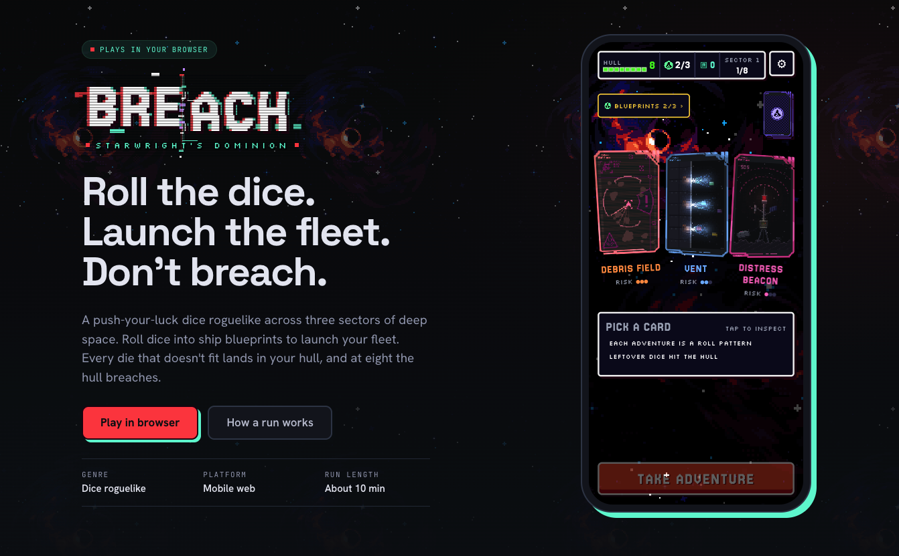

# Breach: Starwright's Dominion (Reddit Edition)

**Roll the dice. Launch the fleet. Don't breach.**

Breach is a push-your-luck dice roguelike across three sectors of deep space. You roll dice into ship blueprints to launch your fleet. Every die that doesn't fit lands in your hull, and at eight the hull breaches. A run takes about 10 minutes.

This repo is the **Reddit edition**: the full game packaged as a [Devvit](https://developers.reddit.com/) app, so it plays directly inside a Reddit post.

- Play in the browser: [breachgame.gg](https://breachgame.gg)
- Devvit app: `breachgame`, playtest subreddit [r/breachgame_dev](https://www.reddit.com/r/breachgame_dev)



## How a run works

1. **Pick an adventure.** Each station offers a few adventure cards (Distress Beacon, Toll Lane, Salvage, Debris Field, Vent...). Every adventure is a roll pattern with its own risk rating.
2. **Roll into blueprints.** Fill blueprint slots with your dice to launch ships.
3. **Mind the hull.** Leftover dice hit the hull. Eight hull damage and the run is over.
4. **Push through the sectors.** Bank rewards, spend at the depot, and travel the sector map across three sectors.

## How it plays on Reddit

The app has two Devvit entrypoints (see `devvit.json`):

| Entrypoint | File | What the player sees |
| --- | --- | --- |
| `default` (inline post) | `src/client/splash.html` → `splash.ts` | The **Post View**: "Choose an adventure" card screen rendered right in the feed, with the **Roll your first adventure** CTA |
| `game` (expanded) | `src/client/game.html` → `game.ts` | The **full game** (Space Dice Run v15) in Reddit's expanded view |

- Clicking the Post View CTA calls `requestExpandedMode(e, 'game')` instead of navigating the iframe (`src/client/splash.ts`, link matching in `src/client/breach/links.ts`).
- Launching from the post always lands on the title screen. `forceStartScreen()` rewrites only the saved `screen` field, so energy, bank, unlocks, and the in-progress run survive (`src/client/breach/start-screen.ts`).
- The prototype's mock clock bar (`devClock`) is shown in the local harness and hidden in production builds.
- Moderators get a **Create a new post** subreddit menu item, and installing the app auto-creates a game post (`src/server/routes/menu.ts`, `src/server/routes/triggers.ts`).

## Game source → Devvit bundle

The game is designed as Design Components (`*.dc.html`) plus the `support.js` dc-runtime, and lives untouched in `breach-concept/`:

```
breach-concept/
  Space Dice Run v15.dc.html   the full game
  Postview.dc.html             the inline post screen
  How To Play.dc.html          rules overlay
  Breach Logo.dc.html          animated logo
  support.js                   dc-runtime
  assets/                      art, sprite strips, music
```

Out of the box that runtime loads React from unpkg, fetches sibling components over the network, `eval`s each component's logic, and pulls fonts and SFX from third-party origins. None of that survives Reddit's webview CSP (`script-src 'self' webview.devvit.net ...`). So a Vite plugin, **`tools/breach-plugin.ts`**, converts the concept into ordinary bundle inputs on every build:

- **One module per component** (`src/client/breach/generated/c-*.js`): raw template plus its logic class **precompiled** into a factory, so nothing is `eval`'d at runtime.
- **Patched runtime** (`generated/dc-runtime.js`): boots from bundled source text, takes prop overrides from the page, never fetches React from a CDN, and does not self-start.
- **Same-origin assets**: art, SFX, and fonts are copied into `public/`, with Google Fonts and R2 SFX URLs rewritten to local paths.

`src/client/breach/boot.ts` then hands the bundled React, components, and logic factories to the runtime and starts it explicitly via `startDc()`. The explicit start matters: in production the runtime lands in a shared chunk that executes before entry code, and self-starting there booted with no React and a blank post.

All generated output is gitignored. Edit `breach-concept/` and it re-syncs on build, under `vite build --watch` (playtest), and live under `npm run dev:tools`.

**Vendored externals:** `scripts/vendor-breach.mjs` is a one-time pull of the SFX pack and Google Fonts into `vendor/breach/` (committed). Re-run it only if the upstream SFX pack or font list changes.

## Updating the game

1. Drop the new design export into `breach-concept/breach reddit/` (gitignored staging folder).
2. Copy the changed `.dc.html` files and assets up into `breach-concept/`.
3. If the game file name changes (e.g. `Space Dice Run v16`), update the import in `src/client/breach/env-game.ts`, the `SAVE_KEY` in `start-screen.ts` if the save key changed, and the Post View CTA match in `links.ts`.
4. `npm run dev` to playtest, then `npm run deploy`.

## Commands

> Requires Node 22.

| Command | What it does |
| --- | --- |
| `npm run dev` | `devvit playtest` on r/breachgame_dev, with `vite build --watch` live-reloading the app |
| `npm run build` | Build client + server into `dist/` |
| `npm run deploy` | Type-check, lint, test, then `devvit upload` |
| `npm run launch` | Deploy, then `devvit publish` for review |
| `npm run login` | Log the Devvit CLI into Reddit |
| `npm run test` | Vitest (start-screen, link matching, server) |
| `npm run dev:tools` | Local harness at `http://localhost:5174` with a stubbed Devvit client, no Reddit login |
| `npm run farnsworth:devvit` | Boots `dev:tools` for the Farnsworth IDE canvas |

### Testing under Reddit's CSP

The dev harness can't catch CDN loads, `eval`, or chunk-ordering bugs. To reproduce Reddit's webview policy locally:

```bash
npx vite build
node tools/serve-prod-csp.mjs        # → http://localhost:5199/splash.html and /game.html
```

The Farnsworth test cases in `.farnsworth/devvit-tests/` (`breach-prod-csp`, `breach-new-run`, `breach-post-launch`, `smoke-splash`) cover the same paths. See [FARNSWORTH.md](./FARNSWORTH.md) for the IDE harness.

## Stack

Devvit Web 0.13.6 · Vite · React 19 · Hono + tRPC (server) · TypeScript · Vitest

## Project layout

```
breach-concept/        game source (Design Components), never edited by the build
tools/breach-plugin.ts concept → bundle bridge (Vite plugin)
tools/serve-prod-csp.mjs  prod build under Reddit's CSP
scripts/vendor-breach.mjs one-time SFX + font vendoring
vendor/breach/         vendored SFX + fonts
src/client/            splash (post view) + game (expanded) entrypoints
src/client/breach/     boot, entry env, start-screen + link helpers
src/server/            Hono server: post creation menu + install trigger
devvit.json            app config: entrypoints, menu, triggers, permissions
```


